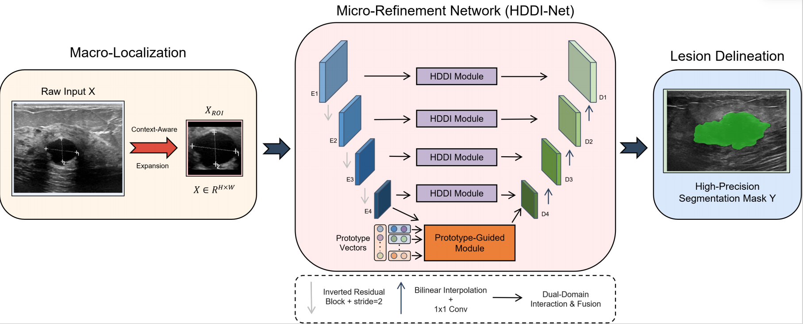
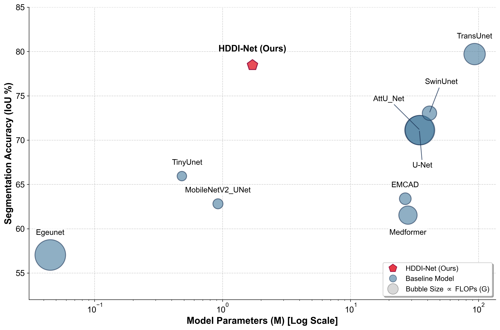

<!-- 📌 请将您的网络架构图命名为 architecture.png 并放到 imgs/ 文件夹中 -->

# # HDDI-Net: Hierarchical Dual-Domain Interaction Network for Robust and Efficient Ultrasound Lesion Segmentation

This is the official repository for **HDDI-Net**, an extremely lightweight (**1.71M parameters**, ~95% fewer than TransUnet) and efficient deep learning framework for robust breast ultrasound lesion segmentation. HDDI-Net combines a **Hierarchical Dual-Domain Interaction (HDDI) Block** for simultaneous spatial texture capture and frequency-domain speckle noise removal, with a **Coarse-to-Fine ROI-aware Framework** to suppress complex background interference.


<div style='display:flex; gap: 0.25rem; '>
<a href='LICENSE'></a>
<a href='#'></a>
</div>

<p align="center" width="100%">
<a target="_blank"></a>
</p>
---

## 🔥 Updates
* **[2026-03]** 🚀 Official code and training/evaluation scripts released.
* **[2026-02]** ⭐️ HDDI-Net achieves competitive SOTA on BUSI and superior **zero-shot generalization** on the unseen TN3K dataset with only **1.71M parameters**.

---

## 🎯 Overview

- We propose **HDDI-Net**, a lightweight yet robust network that achieves an optimal trade-off between segmentation accuracy, computational efficiency, and cross-center generalizability.
- **Coarse-to-Fine ROI Framework**: A two-stage pipeline that first roughly localizes the lesion to filter background noise, then performs fine-grained segmentation within the localized region, significantly improving Precision.
- **Hierarchical Dual-Domain Interaction (HDDI) Block**: Integrates multi-kernel spatial convolution (3×3, 5×5, 7×7 depthwise separable conv) with a DCT-based frequency gating mechanism to perform **physiologically-inspired adaptive speckle denoising**.
- **Prototype-Guided Semantic Consistency**: Implements intra-image self-clustering at the bottleneck to model long-range dependencies without heavy Transformer attention, ensuring compact lesion representations even at batch size = 1.
- **Multi-Scale Deep Supervision**: Applies auxiliary losses at each decoder stage with dynamic weights to accelerate convergence and improve feature learning in the lightweight backbone.

---

## 🕹️ Usage

### 1. Environment Setup

```bash
conda create -n hddinet python=3.9 -y
conda activate hddinet
pip install -r requirements.txt
```

### 2. Data Preparation

Download datasets (e.g., [BUSI](https://scholar.cu.edu.eg/?q=afahmy/pages/dataset), [TN3K](https://github.com/chengkang520/TN3K)) and organize them as follows:

```
.
└── data
    ├── busi
    │   ├── images
    │   │   ├── benign (10).png
    │   │   ├── malignant (17).png
    │   │   └── ...
    │   └── masks
    │       └── 0
    │           ├── benign (10).png
    │           └── ...
    └── tn3k
        ├── images
        └── masks
```

### 3. Training

Train HDDI-Net on the BUSI dataset (internal domain):

```bash
conda activate hddinet
python main.py --max_epochs 100 --gpu 0 --batch_size 8 \
               --model HDDI_Net \
               --base_dir ./data/busi \
               --dataset_name busi
```

Or use the provided Windows batch script:

```bash
run_train.bat
```

### 4. In-Domain Inference

```bash
conda activate hddinet
python main.py --max_epochs 150 --gpu 0 --batch_size 8 \
               --model HDDI_Net \
               --base_dir ./data/busi \
               --dataset_name busi \
               --just_for_test True
```

### 5. Zero-Shot Cross-Dataset Evaluation (TN3K)

Directly evaluate the BUSI-trained model on the completely unseen TN3K dataset:

```bash
conda activate hddinet
python main.py --gpu 0 --batch_size 8 \
               --model HDDI_Net \
               --base_dir ./data/busi \
               --dataset_name busi \
               --zero_shot_base_dir ./data/tn3k \
               --zero_shot_dataset_name tn3k \
               --just_for_zero_shot
```

---

## 🏅 Experiments

<p align="center" width="100%">
<a target="_blank"></a>
</p> 

### Internal Validation — BUSI Dataset

| Method | Params (M) ↓ | GFLOPs ↓ | IoU (%) ↑ | Dice (%) ↑ | Precision (%) ↑ |
|:---|:---:|:---:|:---:|:---:|:---:|
| TransUnet | 93.23 | 24.670 | 72.11 | 83.12 | 84.67 |
| SwinUnet | 41.34 | 8.693 | 71.19 | 82.59 | 82.87 |
| AttU_Net | 34.88 | 51.015 | 72.06 | 79.52 | 80.91 |
| U-Net | 34.53 | 50.166 | 72.28 | 79.17 | 80.15 |
| TinyUnet | <u>0.48</u> | <u>1.270</u> | 60.24 | 66.46 | 66.88 |
| Medformer | 28.073 | 16.878 | 62.93 | 75.18 | 75.37 |
| EMCAD | 26.764 | 4.280 | 63.93 | 74.14 | 77.66 |
| EgeUnet | **0.045** | **0.055** | 55.23 | 64.58 | 64.88 |
| MobileNetV2_UNet | 0.922 | 2.003 | 60.30 | 68.15 | 69.04 |
| SF_UNet | 28.80 | 30.40 | <u>73.40</u> | <u>84.50</u> | <u>84.54</u> |
| MK_UNet | 2.83 | 2.95 | 72.59 | 78.29 | 78.69 |
| FFTMed | 4.04 | 14.50 | 68.50 | 75.15 | 75.89 |
| **HDDI-Net (Ours)** | 1.71 | 3.300 | **77.09** | **87.74** | **89.61** |

*HDDI-Net is the most efficient model that outperforms all lightweight and medium-sized models while closing the gap with heavy models like TransUnet by only 1.2% IoU.*

### TN3K Dataset

| Method | Params (M) ↓ | GFLOPs ↓ | IoU (%) ↑ | Dice (%) ↑ | Precision (%) ↑ |
|:---|:---:|:---:|:---:|:---:|:---:|
| TransUnet | 93.23 | 24.670 | 73.91 | 84.31 | 85.57 |
| SwinUnet | 41.34 | 8.693 | 70.90 | 80.18 | 80.41 |
| AttU_Net | 34.88 | 51.015 | 69.20 | 74.28 | 75.74 |
| U-Net | 34.53 | 50.166 | 70.09 | 75.10 | 76.53 |
| TinyUnet | <u>0.48</u> | <u>1.270</u> | 61.66 | 68.19 | 68.68 |
| Medformer | 28.073 | 16.878 | 63.15 | 76.32 | 77.48 |
| EMCAD | 26.764 | 4.280 | 62.86 | 74.75 | 75.43 |
| EgeUnet | **0.045** | **0.055** | 58.84 | 65.32 | 65.67 |
| MobileNetV2_UNet | 0.922 | 2.003 | 61.34 | 68.68 | 69.93 |
| SF_UNet | 28.80 | 30.40 | <u>75.40</u> | <u>85.86</u> | <u>85.94</u> |
| MK_UNet | 2.83 | 2.95 | 73.40 | 78.69 | 79.69 |
| FFTMed | 4.04 | 14.50 | 68.79 | 75.45 | 76.19 |
| **HDDI-Net (Ours)** | 1.71 | 3.300 | **79.85** | **89.77** | **91.76** |

*With only 1.71M parameters, HDDI-Net surpasses all other medium and lightweight baseline models on the unseen TN3K dataset.*

### Ablation Study — BUSI Dataset

*Note: "w/o Spatial Path" implies the network degrades to a vanilla MobileNetV2-based U-Net with single-kernel convolutions.*

| Method | IoU (%) ↑ | Dice (%) ↑ |
|:---|:---:|:---:|
| **HDDI-Net (Full)** | **77.09** | **87.74** |
| w/o Frequency Path | 73.70 | 83.73 |
| w/o Spatial Path | 72.79 | 80.62 |
| w/o Prototype Module | 72.67 | 80.70 |
| w/o ROI Framework | 70.42 | 78.30 |

---

## 📝 Related Projects

- [U-Bench](https://github.com/FengheTan9/U-Bench): A Comprehensive Understanding of U-Net through 100-Variant Benchmarking
- [TransUnet](https://github.com/Beckschen/TransUNet): Transformers Make Strong Encoders for Medical Image Segmentation
- [SwinUnet](https://github.com/HuangBo-Terraman/SwinE-Net): Swin Transformers for Medical Image Segmentation
- [AttU_Net](https://github.com/ozan-oktay/Attention-Gated-Networks): Attention U-Net: Learning Where to Look for the Pancreas

---

## 📬 Contact

For questions or collaborations, feel free to open a GitHub Issue.

⭐ Star this repo if you find it useful!
